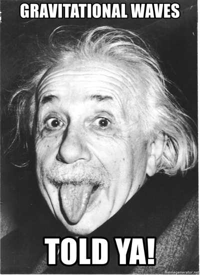
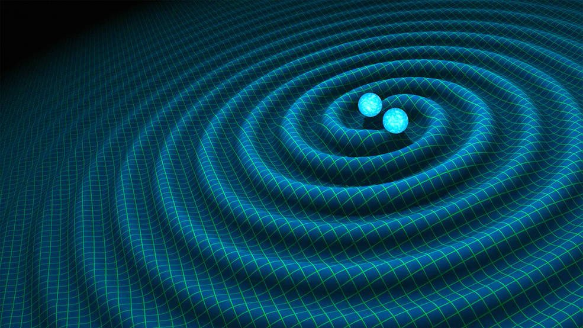

### The Legacy of General Theory of Relativity

Approximately hundred years back, a man with par genius intellect brought revolution in the way we see and perceive things around us and completely changed the definition of space, time, causality, and gravity. The man was Dr. Albert Einstein and in 1915 with this General Theory of Relativity, he shook the whole physics community by claiming that “Gravity is not a force !”, rather its the effect of some more fundamental mechanics in higher dimension (4D) which we perceive in our 3D world as force and objects getting attracted by it. Back then the theory was very abstract and there was no way to test it using available technology at that time. But with time, technology developed and people conducted tests for which General Relativity withstood every single test and community started to accept this as more correct theory for gravity also known as relativistic theory of matter, light and gravity. A similar test was proved correct that happened on 14 September 2015 (announced on 11 February 2016) which was the traced signatures of gravitational waves from a system of binary black hole merger by the LIGO. The gravitational waves is a peculiar feature of Einstein’s GTR and was predicted back in 1916 by Einstein.

You can see it took approximately hundred years for the technology to evolve at the point where we were actually able to measure this ultra small disturbances in the spacetime fabric. The detection of gravitational waves were the biggest discovery in physics in the 21st century and triggered a whole new world of research for fields like gravitational waves astronomy, black hole physics, astroparticle physics etc.

There is one big problem in the field of gravitational physics and that is solving Einstein’s field equations for arbitrarily complicated matter distribution. The solution of these equations are actually geometry of 4D spacetime (contained in metric tensor) around that matter field.The field equations are system of second rank tensor differential equations which have a very non-linear structure in them (there are contractions of Riemannian tensor). These equations are exactly solvable for only some simple matter distribution under symmetry consideration. Now for arbitrarily complicated system just like binary black hole merger, these equations are solved numerically. The field which deals with methods of solving field equations which includes its background mathematics (“3+1” GR formulation, methods to solve partial equations) and development of efficient algorithms to actually solve these equations on real workstation comes under the subject of numerical relativity.

### Why we need a library like this ? 

Now why we need a python library like EinsteinPy? The above calculations for the solution of field equations are exhaustive and can be really hard for someone who does not no any or little programming. These simulations of complicated system are of immense importance and researchers often find such platforms which can actually simulate them efficiently on their workstation. The problem with currently available simulating platforms are that they assume a pretty mature background in programming and that too in languages like C, C++ or some other synthesized wrappers. Often researchers working in the field of gravitational physics are purely from theoretical side and except numerical relativists, they find using these platforms head-wiggling. So considering all the above problems, this library sheds away with all the programming and algorithmic view of solving these equations (which mostly a numerical relativist would only know) and provide a user friendly level of abstraction which would enable anyone to simulate binary black hole merger on their local workstation with just 15 to 20 lines of python code.
