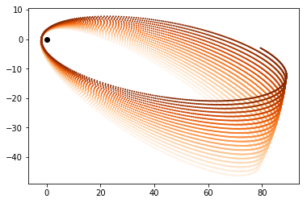

## The journey so far

Since the past one and a half months, we have gone from "Creation of einsteinpy from astropy package template" to our first ever release on both [PyPi](https://pypi.org/project/einsteinpy/) and [Anaconda](https://anaconda.org/conda-forge/einsteinpy) with version `0.1.0`. We couldn't have moved forward this fast without the encouragement and love of the open source community. The library has seen a constant influx of stargazers on github as well as people who are willing to contribute to the library in various ways. So, we thank those who supported us in this journey from the bottom of our heart.

## Little Introduction to EinsteinPy

EinsteinPy is an open source python library for supporting numerical relativity, relativistic astrophysics and gravitational physics related research and projects. It aims to provide an user-friendly high level abstraction for non-programmers and shed away the numerical and algorithmic viewpoint of the implemented methods.

The library tries to implement most of the interesting phenomenons in gravitational physics like relativistic orbit calculations, gravitational lensing, time-like and null geodesics in different geometries and many more. Its utility increases further as the library provides support for symbolic calculations of core GR quantities like Christoffel symbols, Riemannian curvature tensor as well as simplification of various related expressions.

The ultimate goal of the library is to provide numerical solutions for Einstein’s field equations and its application in relativistic hydrodynamics, magnetohydrodynamics, compact objects and many other fields of astrophysics. We envision it as a “de facto” choice for both amateurs and professionals in the field of gravitational physics.

|  | 
|:--:| 
| *Advance of perihelion of an object around a massive body plotted using EinsteinPy using only 5 lines of code excluding imports* |

## Application for SOCIS 2019

ESA Summer of Code in Space (SOCIS) is a program run by the European Space Agency that focuses on bringing student developers into open source software development for space applications. Students work with a mentoring organization (with potential support from ESA experts) on a 3 month programming project during their summer break.

We've applied to SOCIS, as we aim to bring in new contributors, expand the community, further fastrack the project and being recognized in the scientific community.

For this, a comprehensive list of five ideas have been carefully formulated by the board members of The EinsteinPy Project, which can be found [here](https://github.com/einsteinpy/einsteinpy/wiki/SOCIS-Ideas).

|  | 
|:--:| 
| *Frame dragging effect in Kerr space-time on a freely falling object calculated using EinsteinPy* |
