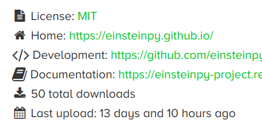

## Albert Einstein's Birthday

Nine days ago, the world celebrated birthday of the greatest scientist this planet has ever seen,
Prof. Albert Einstein. He did something which was amazingly difficult and unintuitive to grasp. For a very long time, General Relativity was actually understood by just a handfull of people. While it was also getting very difficult for us to visualize and understand how things are working, we thought of doing something about it on our own. We decided to name this python package "EinsteinPy" because we wanted to pay a small tribute to what Prof. Einstein has given to this mankind. Even today, not many people actually know how gravity works. Neither did Sir Isaac Newton in 1687. But a person understood every detail of it in 1907. He was a true genius. We all salute you sir, for what you've done and for leaving a mark in the minds of billions of people forever.

## 50 stars on GitHub

I can't express the happiness while writing this, but the pace at which this project is progressing is just amazing. We started writing code for this on 30 January 2019. And it's not even been 2 months and we have reached 50 stars on GitHub. I will request everyone to please support us by starring as well as reporting bugs, issuing feature requests, finding typos/errors in documentation and most importantly, contributing to the project. Any help in any way is highly appreciated. All the developers who wish to contribute to einsteinpy can have a look at the [contribution guidelines](https://github.com/einsteinpy/einsteinpy/blob/master/CONTRIBUTING.rst). You can always open an [issue](https://github.com/einsteinpy/einsteinpy/issues) or reach out to us with your queries on [mailing list](https://groups.io/g/einsteinpy-dev) or [chat](https://riot.im/app/#/room/#einsteinpy:matrix.org). Every board member will be happy to help with any kind of queries.

|  |
|:--:|
| *A snapshot of einsteinpy/einsteinpy on this very special day!* |

## 50 downloads on conda-forge

We released EinsteinPy 0.1.0 according to the schedule on 8th March 2019 on [PyPi](https://pypi.org/project/einsteinpy/). Although, the release on [Anaconda](https://anaconda.org/conda-forge/einsteinpy) got a bit late due to packaging efforts required in Anaconda. Still, in a very short span of 13 days since the Anaconda release, the package has been already downloaded 50 times around the world. One can just imagine the number of downloads through `pip`.


|  |
|:--:|
| *The snapshot of the historic day for EinsteinPy* |


## Debian Package: Coming Soon!

Yes, you heard it right! Very soon, you will be able to install EinsteinPy by just typing:

```
  $ sudo apt install python3-einsteinpy
```

It has already been listed in debian's package lists of [Python 3](https://blends.debian.org/astro/tasks/python3) and [Simulation](https://blends.debian.org/astro/tasks/simulation).

EinsteinPy will be shipped with [Debian Astro Pure Blend](https://blends.debian.org/astro/) and will be available in Ubuntu 19.10 and Debian 11 for download.

Thanks for reading!
