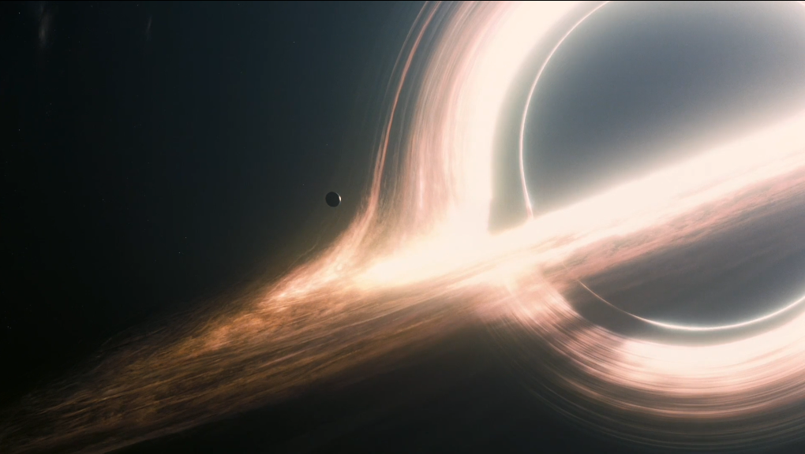

```
>>> print("Hello, World!")
Hello, World!
>>> 
```
Hi, I am Jyotirmaya Shivottam, a Physics Undergrad at [National Institute of Science Education and Research, Bhubaneswar](https://www.niser.ac.in/). I am thrilled to have been selected in Google Summer of Code 2020 to work on implementing a module for Null Geodesics in Kerr and Schwarzschild Spacetimes in [EinsteinPy](https://einsteinpy.org/), under [OpenAstronomy](http://openastronomy.org/). This will (tentatively) be an 8-part blog series.

---
## A Brief History of my brush with Numerical Relativity and EPY

I had developed an interest in Cosmology and in particular, Einstein's Theory of Relativity, after taking a course in the Special Theory of Relativity, at my university. The course content and presentation intrigued me. So, I decided to read up more on the subject and found the mathematical description of spacetime in General Relativity immensely satisfying. But soon after, it became difficult to visualize the complicated geometries. I am used to understanding things by putting them in code. So naturally, I endeavoured to do the same here. After a brief period of trying and failing to solve it myself, in true programmer fashion, I started looking up software projects that could help me. I was surprised to find that most projects were either in outdated `FORTRAN77` (yikes!), or in `CUDA C`, which gets messy to set up. Then, I found EinsteinPy, which is a python package for Numerical Relativity. Their GitHub Repo had listed an issue quite similar to what I wanted to solve. I also came to know that they were participating in GSoC this year and so, I picked up and solved an issue and opened a PR. Thus began my voyage into the world of Numerical Relativity and Free & Open Source Software.

But enough about me. Let me introduce you to the project, that I will be spending this summer on.

## Null Geodesics - Is it another Java Exception? (Spoiler Alert: NO!)

As mentioned before, my project is on implementing Null Geodesics in Kerr and Schwarzschild Spacetimes. Geodesics can be understood as a generalization of the concept of shortest paths, between two points, to higher dimensions. In Euclidean or flat geometries, a geodesic is a straight line and in trivial non-Euclidean geometries, like a thin spherical shell, it is an arc of a great circle. Around 115 years ago, Einstein, through his Special Theory of Relativity and then, through its successor, ten years later, the General Theory of Relativity (GR), unified our understanding of space and time into a 3+1-Dimensional *spacetime*, where many Euclidean axioms and equations no longer work, partly due to the special behaviour of the time dimension (hence, 3+1D). GR, in particular, sheds a lot of light on the relation between the geometry of spacetime and the distribution of matter in it and how they affect each other. Here, John Archibald Wheeler's famous quote on GR comes to mind:

> "Spacetime tells matter how to move; matter tells spacetime how to curve".

This correspondence, in mathematical form, is given by Einstein's Field Equations (EFE):

$$\boxed{R_{\mu\nu} - {\tfrac{1}{2}}Rg_{\mu\nu} + \Lambda g_{\mu\nu} = {\frac {8\pi G}{c^{4}}}T_{\mu\nu}}$$

Where, you can understand the left-hand side as describing the spacetime curvature (geometry), while the right-hand side describes the matter-energy content of the spacetime. A helpful analogue might be Gauss' Divergence Theorem from Electromagnetism: $\nabla V = -\rho/\epsilon_0$, where the left-hand side describes the structure of a scalar electric potential field, while the right-hand side describes the charge distribution. The potential field tells charges how to arrange themselves, while charges tell how the potential should vary.

The equation above is a Tensor Equation, wherein we solve for $g_{\mu\nu}$, the spacetime Metric Tensor or simply, the Metric. $g_{\mu\nu}$ defines the geometry of the spacetime. The aforementioned Kerr and Schwarzschild Spacetimes are in fact, Kerr and Schwarzschild Metric Tensors. These fall under a special class of EFE solutions, namely "Vacuum Solutions", because they describe a spacetime, devoid of any matter or non-gravitational fields. The Kerr Metric describes the spacetime around an uncharged, rotating, axisymmetric Black Hole, while the Schwarzschild Metric is a particular simplification of Kerr Metric to non-rotating Black Holes.

Now that we have our spacetime geometry set up, we can think about how the motion of massive objects (read: having non-zero mass, e.g. neutrons) and massless objects, like photons, that make up light, would look like in the spacetime. Here's where, geodesics come in, now in 3+1D. They characterize the paths of such objects, given the metric. The corresponding Geodesic equation can be derived using the metric and the [Equivalence Principle or through Variational Methods](https://en.wikipedia.org/wiki/Geodesics_in_general_relativity) and is given as:

$$\boxed{{\mathrm{d}^{2}x^{\mu} \over \mathrm{d}\lambda^{2}} + \Gamma^{\mu}_{\alpha \beta}{\mathrm{d}x^{\alpha} \over \mathrm{d}\lambda}{\mathrm{d}x^{\beta} \over \mathrm{d}\lambda} = 0}$$

Here, $x^\alpha$ is 4-position of the object in motion (Position vector in a 3+1D spacetime), $\Gamma^{\mu}_{\alpha\beta}$ or the Christoffel Symbols are a convenient way of writing metric derivatives (derivatives of $g_{\mu\nu}$) and $\lambda$ is called an Affine Parameter, that is helpful in describing a general geodesic. You might ask, if we are talking about a moving object, why not use time (in particular, "Proper Time", $\Delta\tau$), instead of some arbitrary $\lambda$ parameter. The reason behind this and the importance of this parameter will be apparent soon.

We have understood, what spacetime and geodesics refer to (even though, we glossed over most details :P), but what are *Null Geodesics*? Simply speaking, all massive objects follow time-like geodesics and all massless objects, like light, follow null-like geodesics. Before going into the distinction, we need to know, what "Proper Time" means. Proper Time ($\Delta\tau$) is the time measured by a clock in an object's rest or proper frame. This is the time physically experienced by the object. Now, the distinction between paths, followed by massive and massless particles, or correspondingly, "time-like" and "null-like" geodesics, arises due to the causal structure of spacetime, in which the constancy of Speed of Light in vacuum plays a major role. Light or massless particles always move at the speed of light, at 299,792,458 m/s. This implies that we cannot construct a reference frame, where a clock is at rest with respect to the photon or massless particle, as no clock can move at that speed. Thus, no proper time ever elapses for light rays or massless particles, i.e. $\Delta\tau = 0$. This is also why, we cannot use $\Delta\tau$ in the geodesic equation to obtain the paths, traced by massless particles. So, we seek another parameterization and that is given by the affine parameter, $\lambda$. Do note that, for massive objects, $\Delta\tau$ works just fine, as it is well-defined there.

And so, we have assembled all the parts for getting a basic understanding of "Null Geodesics in Kerr and Schwarzschild Spacetimes". In my GSoC project, I will be implementing a numerical solver for the geodesic equation for null geodesics and I will use the computed geodesics for Radiative Transfer calculations. At the moment, the Community Bonding Period is underway. My mentors and I have set up a weekly meeting schedule, where we brainstorm on the project specifics. An outcome of those meetings is an [EPE](https://github.com/einsteinpy/EinsteinPy-EPEs/pull/4) (EinsteinPy Proposal for Enhancement), where you can find the details on my proposed implementation and coolest of all, you can help shape the implementation, if you are interested. Isn't open source awesome? (Yes, it is!)

## What now?

I plan to document my progress with the project here, with biweekly blogs. While this blog was physics-heavy, the plan for the next blog is to post a distilled summary of the actual code implementation. Nonetheless, I hope, you found this small introduction into the domain of Relativity interesting. If you wish to play around with some numerical relativity (especially during this pandemic, when most are home and bored), you can try out EinsteinPy. For now, I will leave here with a small tidbit:

> If you've watched Chris Nolan's brilliant movie, Interstellar, and ever wanted to simulate and obtain a Black Hole "image" similar to Gargantua, all you would need to solve is the geodesic equation alongside a couple more complicated equations. A brilliant resource to do that is a [Mathematica Notebook](http://www.its.caltech.edu/~kip/Interstellar/RayBundleDerive.nb), hosted on Dr. Kip Thorne's personal Caltech homepage.



---