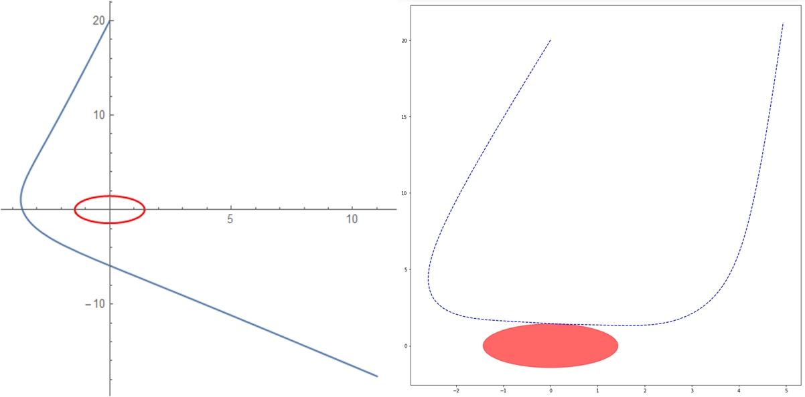
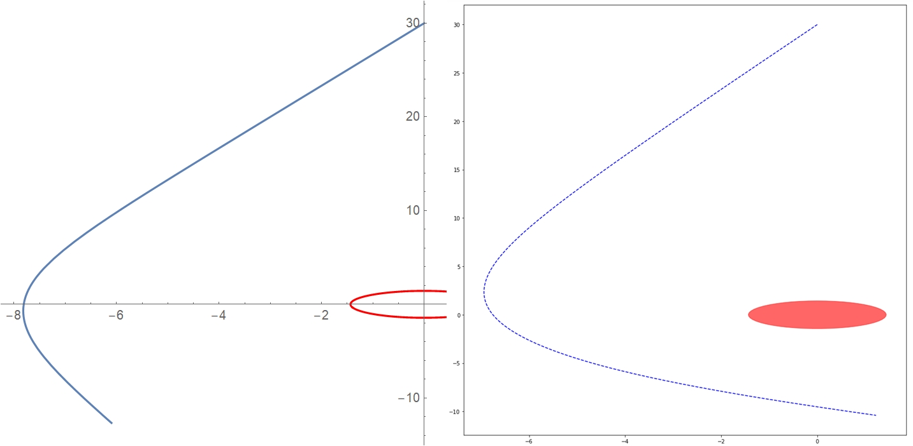
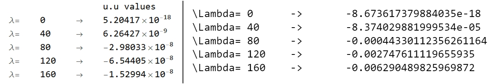

## Progress so far...

Support for calculation and graphing of Null Geodesics in Kerr (and by extension, Schwarzschild) spacetime is nearing completion (PR [#527](https://github.com/einsteinpy/einsteinpy/pull/527)). Last week, I hit a serious obstacle, related to maximum floating point precision and accumulation of numerical errors (which is also the reason for the delayed blog). Since the Geodesic Equations are stiff ODEs, small instabilities can wreak havoc on step-size control and completely destabilize the solution. I observed this happening with my code for Null Geodesics. As the light ray approaches the black hole, the integrator can no longer choose a proper step-size and the solution becomes inaccurate. In this blog, I will be discussing this issue and how we are approaching it with the new Null Geodesics module. I also present some of the null geodesic plots, created using this module.

## Stiff ODEs are evil!

Stiff ODEs and Numerical Methods have always been at loggerheads. There is no precise definition for stiff ODEs, but an important feature is that, they are prone to become unstable. The usual solution is to choose a solver, that can accommodate very small step-sizes, while keeping overall error low. SciPy provides performant wrappers for LSODA/BDF methods, that are usually suitable for stiff systems, but in our case, these methods are unhelpful, as can be seen in the image below. For comparison, I have used Mathematica to obtain geodesics for the same conditions. The only major difference, here, is the solver. The plot on the left is Mathematica-generated, while the plot on the right was generated by Python. Note that, all the plots in this post have their axes normalized to the gravitational radius, or units of $\frac{GM}{c^2}$.



The initial conditions for the plots above are as follows. The timelike component of the initial velocity was calculated by setting $g_{ab}u^au^b = 0$.
```
a = 0.9
end_lambda = 200
max_steps = 200
position = [0, 20., pi / 2, pi / 2]
velocity = [-0.2, 0., 0.002]
```
Other solvers (that are suited to non-stiff problems) become unstable long before the desired number of integration steps is reached. Given the lack of a proper solver, I wrote my own solver, using a step-size control scheme from the venerable Numerical Recipes (Press et al, 2007), fine-tuned to the problem. Sadly, this did not produce better results and it even failed for certain pathological higher-order orbits. Here, "high-order" implies "loopy" orbits, very close to the black hole, while "pathological" can encompass higher-order orbits to orbits, that are scattered at large angles (i.e., orbits, with sharp turning points, à la the plots above).

Then, I set out to find the reason behind the instability. Based on my tests, the stiffness comes from the singular nature of the black hole horizon (in Boyer-Lindquist coordinates), which can force the solver to choose incredibly small step-sizes, which in turn leads to more and more floating point error and over large intervals, the obtained solution becomes completely unphysical. This is what, "unstable" means here. Apart from the graphical representation of the instability through the plots, we can also see the instability numerically, through the norm of 4-Velocity of the light ray, as it evolves:


All of these values should be ~0 and on comparing with the plot on the right, it is easy to see, that the norm becomes too high as the light ray gets closer to the black hole. This tells us, that a correlation exists between the initial conditions and the instability, which is expected.

In discussions with my mentors, we explored a few solutions, such as, using another system of units or coordinate system. However, we are already using the most suitable unit and coordinate systems for numerical computation of geodesics - _M_-Units and Boyer-Lindquist Coordinates. I should note here, that at slightly larger initial radial distances and speeds, the code provides a good approximation to the actual solution, as can be observed in the plot and table below.



Clearly, the accumulated error over lambda is smaller in this plot.

The initial conditions for the second set of plots are as follows:
```
a = 0.9
end_lambda = 200
max_steps = 200
position = [0, 30., pi / 2, pi / 2] # Only difference
velocity = [-0.2, 0., 0.002]
```


## Until next time...
Initially, I had planned to develop the Null Geodesics module, such that simulating a photon sheet would be possible through this module itself. The purpose would be applications in radiative transfer calculations, which require simulation of pathological orbits for better approximations in the strong gravity regime. But the issue of error accumulation has made it difficult to continue with this strategy. We have decided to make the current code merge-ready, while keeping the PR open, mainly because, the code performs well at larger initial distances. I have already made relevant changes to ensure the code is merge-ready. The status of the PR can be viewed at [PR #527](https://github.com/einsteinpy/einsteinpy/pull/527).

I am currently mulling the option of implementing the code in some low level language and then, building a wrapper around it, goal being to achieve better error-control, which I have not been able to obtain with Python/SciPy. Another approach that I am considering, is to restrict integration near the event horizon, based on step-size changes. Since multiple options are being explored and this is the last coding period, I have decided to make these blogs weekly. So my next blog should be up, next Friday. Hopefully, I will have solved this by then.