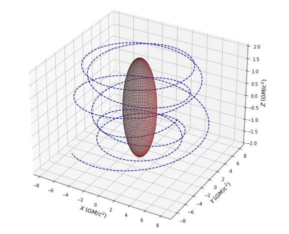
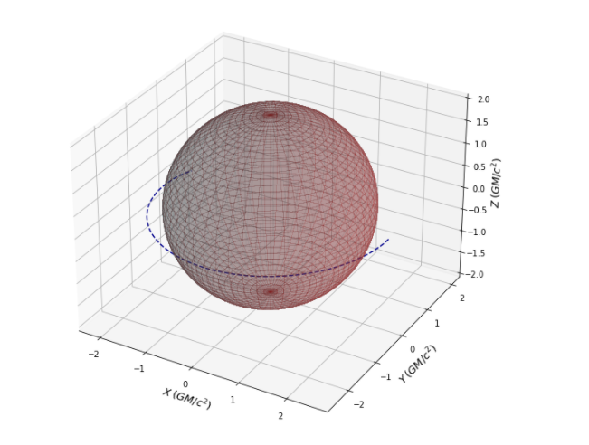
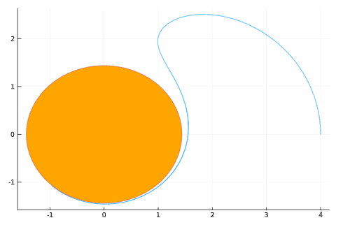
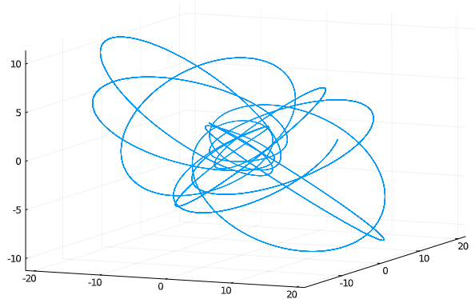
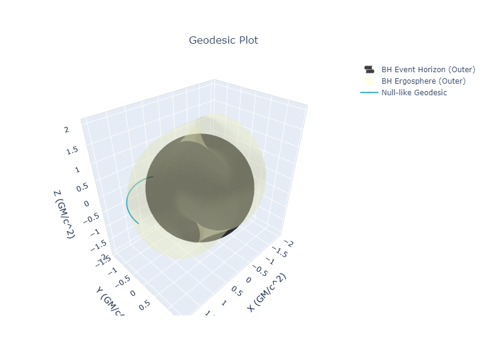
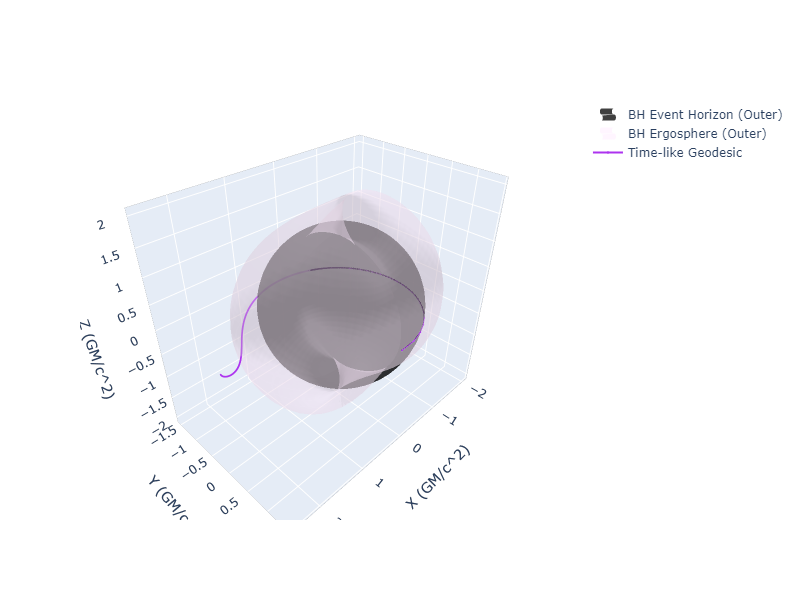
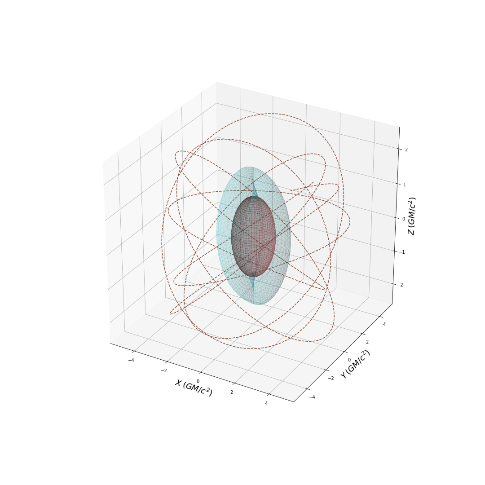
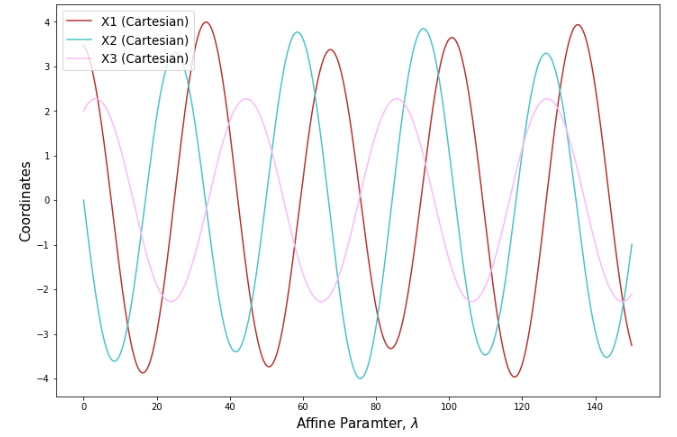

Null Geodesics functionality has been implemented into EinsteinPy, with PR[#527](https://github.com/einsteinpy/einsteinpy/pull/527), having been merged 🎉🎉. I apologize for no blogs in the past 3 weeks. There was a COVID situation here, that required multiple tests and isolation and all that it entails. This led to me foregoing an entire week. And, when that had settled, I had to take the call on abandoning the plan of numerically integrating the Geodesics equations, due to the massive error accumulation, as discussed in my last blog. A confusing fact about that, was that _Mathematica_ could still keep the error build-up to a minimum, while _Python_ simply could not, even with adaptive and symplectic schemes. But the symplectic schemes did bring the error down, by around 2 orders of magnitude, which gave me the idea to take a Hamiltonian approach, which would increase the number of ODEs to solve, but drop the order by 1. And, as it turns out, the Kerr Hamiltonian is separable (Carter, 1968a [1]), which makes the implementation even simpler. In this blog, I will be discussing this approach, which has finally led to proper geodesic calculations. I have also included some plots (and a cool animation) for Kerr & Schwarzschild Null-like (and Time-like) geodesics.

## Some Physics...

In Chapter 33 of _Gravitation_ [2], the authors expound on Carter's seminal paper from 1968, titled, "_Global Structure of the Kerr Family of Gravitational Fields_", and present some nice results from it, one of which is a derivation of the Kerr (super-)Hamiltonian, which can be written as follows (in the _M_-Unit system ($G = c = M = 1$):
$$
\mathcal{H} = -\frac{(a^4 (E^2 - 2 p_r^2) - 8 a E L r - 2 r (p_\theta^2 (-2 + r) + p_r^2 (-2 + r)^2 r - E^2 r^3) + a^2 (2 L^2 - 2 p_\theta^2 - 4 p_r^2 (-2 + r) r + E^2 r (2 + 3 r)) + (a^2 + (-2 + r) r) (a^2 E^2 \cos 2\theta - 2 L^2 \csc\theta^2)}{4 (a^2 + (-2 + r) r) (r^2 + a^2 \cos\theta^2))}
$$
where, $E = -p_t$ and $L = p_\phi$ are the energy and orbital angular momentum of the test particle, respectively. Note that, this Hamiltonian is for a general test particle, i.e., it can be massive or massless. Then, the dynamical equations of motion can be derived easily, using Hamilton's principle, i.e.:
$$
\frac{\mathrm{d}q_i}{\mathrm{d}\lambda} = \frac{\partial\mathcal{H}}{\partial p_i} \quad
\frac{\mathrm{d}p_i}{\mathrm{d}\lambda} = -\frac{\partial\mathcal{H}}{\partial q_i}
$$
I calculated these in _Mathematica_, and the corresponding notebooks and the Python code, making use of these, can be accessed [here](https://github.com/einsteinpy/GSoC-2020/tree/master/Code).

## ...and some plots
Unfortunately, even with these first order ODEs, the error accumulation issue in Python persisted, as can be observed in the plots below. Note that, these results were obtained with a symplectic leapfrog solver, which should, in principal keep the error build-up to a minimum.

<figure>
  
  <figcaption>Kerr Null-like Escape</figcaption>
</figure>
 
Although, for shorter integration durations, the results were good.

 

<figure>
  
  <figcaption>Kerr Null-like Capture</figcaption>
</figure>

After discussions with my mentors, I looked into other languages, that could help and we chose Julia, due to its excellent [DifferentialEquations.jl](https://diffeq.sciml.ai/stable/) suite and "closeness" with Python. Another key bit is that, the _HamiltonianProblem_ type, offered by [_DiffEqPhysics_](https://github.com/SciML/DiffEqPhysics.jl), immensely simplifies the process of solving the system, as it uses Forward Mode Automatic Differentiation to automatically calculate the partial derivatives from the Hamiltonian. The separable nature of the Hamiltonian helps here. Considering all this, I implemented a module in Julia and voilà, the results are accurate, even for some quirky geodesics.

<figure>
  
  <figcaption>Kerr Null-like Capture (Plotted using `Plots.jl`)</figcaption>
</figure>
 
<figure>
  
  <figcaption>Schwarzschild Whirl (Plotted using `Plots.jl`)</figcaption>
</figure>

Now came the problem of integrating the Julia code with EinsteinPy, for which I looked towards _PyJulia_. However, it has some issues with [installation on *nix systems](https://pyjulia.readthedocs.io/en/latest/troubleshooting.html). So, I opted to write my own wrapper, using Python's `subprocess`. and, with the help of my GSoC mentor, Shreyas, packaged the Julia module and the Python wrapper into what is now [`einsteinpy_geodesics`](https://github.com/einsteinpy/einsteinpy-geodesics), an add-on module to EinsteinPy.

On top of this, I also overhauled the geodesic plotting module and added support for 3D animations, parametric plots and choice of spatial coordinates in 2D plots, in both `Static` and `Interactive` modes (that use `matplotlib` and `plotly` respectively). I present some of the plots, produced through the final API, below. The plots shown here, have a mix of both `Static` and `Interactive` back-ends, as well as time-like and null-like geodesics.

 
<figure>
  
  <figcaption>Kerr Null-like Geodesic</figcaption>
</figure>
 
<figure>
  
  <figcaption>Kerr Time-like Geodesic</figcaption>
</figure>
 
<figure>
  
  <figcaption>Kerr Frame Dragging</figcaption>
</figure>
 
<figure>
  
  <figcaption>Schwarzschild Precession</figcaption>
</figure>
 
<figure>
  
  <figcaption>Schwarzschild Time-like Closed Orbit</figcaption>
</figure>
 
<figure>
  
  <figcaption>Schwarzschild Time-like Closed Orbit Parametric Plot</figcaption>
</figure>

## Until next time...

The EinsteinPy geodesics API currently provides a choice of solvers, between a python back-end and a julia back-end, through the optional `einsteinpy_geodesics` add-on. I will continue to work on improving the python back-end, but for now, `einsteinpy_geodesics` adds proper & accurate geodesic calculations to EinsteinPy, in the Kerr family of spacetimes (that includes Schwarzschild). Also, a notable aspect of the `HamiltonianProblem` approach is that, in principle, it should be easily extensible to Kerr-Newman geodesics, which is something, I'd like to explore, as soon as my GSoC commitment is over. I have another short blog coming up, that explains how to use the API (and has more cool plots), that will probably also be the last GSoC blog. Till then, I leave you with a nice animation, created entirely with EinsteinPy.

<figure>
  
  <figcaption>(Extremal) Kerr Time-like Constant Orbit</figcaption>
</figure>

----

#### References:

[1]: Carter, Brandon; [_Global Structure of the Kerr Family of Gravitational Fields_](https://link.aps.org/doi/10.1103/PhysRev.174.1559), 1968 , Physical Review, 174(5), pp. 1559-1571

[2]: Misner, Charles W. and Thorne, K.S. and Wheeler, J.A; _Gravitation_, 1973, W. H. Freeman, ISBN: 978-0-7167-0344-0, 978-0-691-17779-3